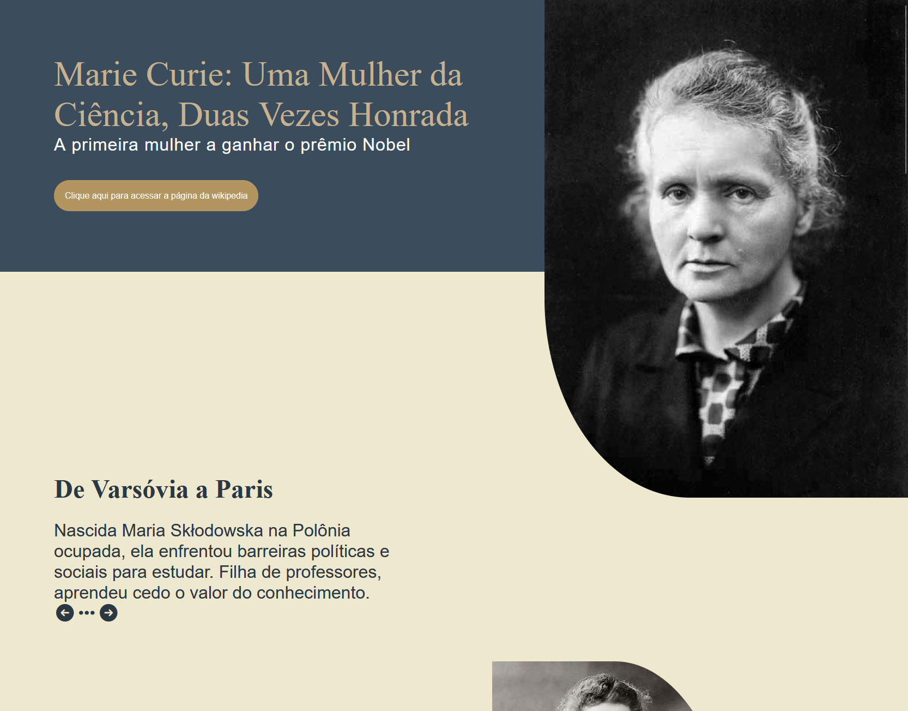
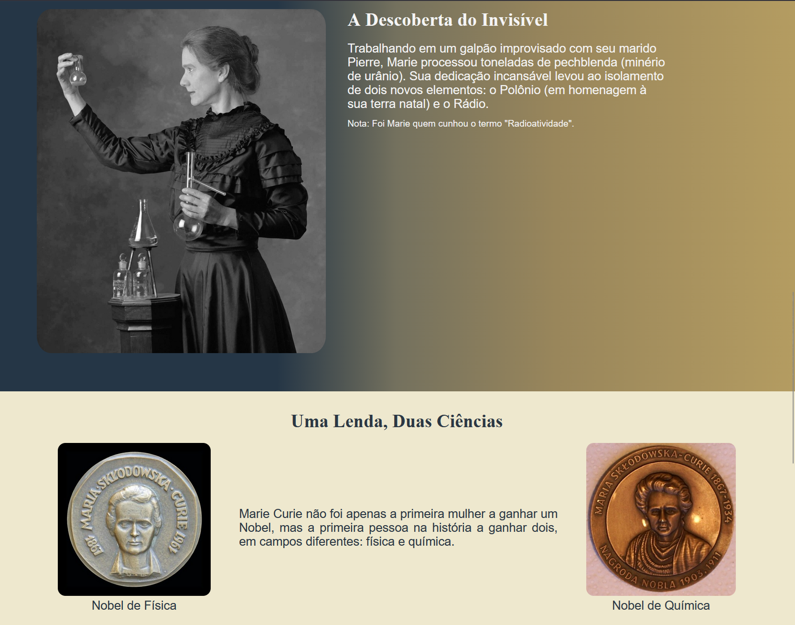

# Página de Homenagem à Marie Curie
## Sobre o projeto

Essa é uma página de homenagem à Marie Curie, praticando HTML semântico, expandindo meu conhecimento do Box Model e aprendendo o "checkbox hack".

Esse projeto foi fundamental para praticar o uso conjunto do HTML semântico com divs para estilização, escolhendo quais tags melhor se encaixavam em cada parte do código. Além disso, serviu para praticar e entender melhor o conceito do Box Model e aprender o "checkbox hack" que, na falta do JavaScript, disponibilizou uma opção viável para criar interatividade no site.

## Tecnologias Utilizadas
HTML5: Estrutura Semântica (header, main, p, img, section, figure).
CSS3: (@media, flexbox, classes utilitárias, posicionamento)

## Screenshot

## Como visualizar
Clique no link abaixo
**[Acesse o Deploy do Projeto aqui](adicionar o link aqui depois)**

## Fonte das citações
https://en.wikiquote.org/wiki/Marie_Curie
